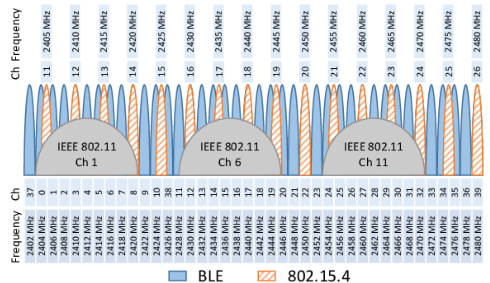
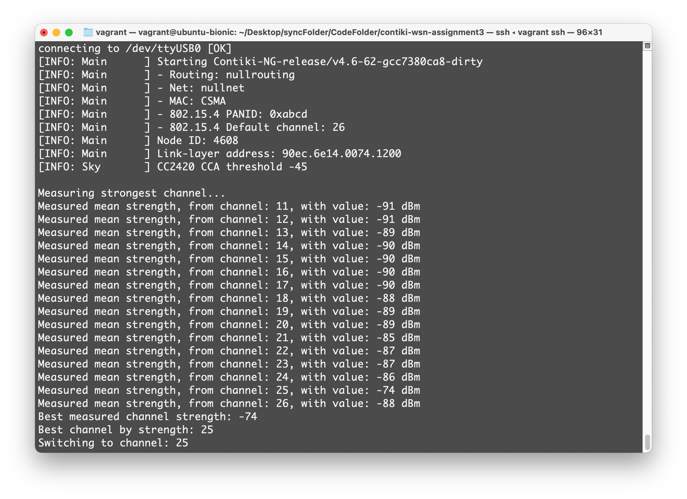

# Channel sensing by noise/inference status
IEEE 802.15.4 uses ISM band 2.4 GHz radio frequencies (from channel 11 to channel 26) to transmit sensor data. These frequency are also used by other radio technologies, such as WiFi, Bluetooth, and others. To setup a WSN, it is an important step to select a channel with minimum interference. A practical approach is to leverage channel sensing to identify the channel inference status by measuring the noise/interference signal strength

The following steps should be completed using a sensor node:

1. Write a program to measure the noise/inference signal strength of different channel (from channel 11 to channel 26).
   - To learn how to set up the channel
   - To measure RSSI of the noise/interference at different channels. You should decide how long to
    measure the RSSI value and how to deal with the measures in each channel. Please refer to the datasheet CC2420 about how to convert the RSSI register value      to the RSSI value in dBm https://www.ti.com/product/CC2420
    
2. Compare noise/inference status at different channels and select the best channel.
<p align="center">
  
</p>

## Compiling and uploading the program
Check serial port:
```
make TARGET=sky motelist
```
Compile, upload and log into the sensor
```
make TARGET=sky PORT=/dev/ttyUSB0 main.upload login
```

## Console dump from Telos B. mote
<p align="center">
  
</p>
